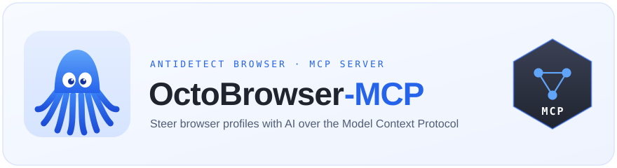

<div align="center">



<br>

**Hand your AI assistant the wheel of Octo Browser — antidetect profiles, driven in plain language.**

[](https://github.com/eforus-overseer/octobrowser-mcp/actions/workflows/ci.yml)
[](https://www.python.org/downloads/)
[](https://modelcontextprotocol.io/)
[](https://mypy-lang.org/)
[](https://docs.astral.sh/ruff/)
[](LICENSE)

<samp>[What it does](#what-it-does) · [How it fits together](#how-it-fits-together) · [60-second start](#60-second-start) · [Configuration](#configuration) · [The tool belt](#the-tool-belt-37-tools) · [In practice](#in-practice) · [Troubleshooting](#when-things-go-sideways)</samp>

</div>

---

## What it does

Driving fleets of antidetect profiles by hand is a grind. **OctoBrowser-MCP** puts an MCP relay between your AI assistant (Claude Code, Cursor, …) and [Octo Browser](https://octobrowser.net/), so a sentence does the work of a dozen clicks:

> *"Start profile `5249_US`, open google.com, and grab a screenshot."*

The assistant finds the profile, launches it through Octo's local API, latches onto the running browser over CDP, navigates, and hands back the picture — no scripts, no dashboards.

**What you get:**

- 🐙 **Whole profile lifecycle** — launch, halt, look up and manage profiles across Octo's local *and* cloud APIs.
- 🎛️ **Real browser steering** — navigate, click, type, scroll, screenshot, evaluate JS, all over Playwright/CDP.
- ⚡ **Throwaway profiles** — spin up one-time profiles that vanish on halt; perfect for scraping.
- 🗂️ **Multi-tab command** — open, switch and close tabs on demand.
- 🌐 **Remote & Docker aware** — WebSocket endpoints get rehomed to your configured host automatically.
- 🛡️ **Polite under throttle** — bounded retries that honour `Retry-After` on HTTP 429.

## How it fits together

Three modules, one job each — the relay never talks to Octo or the browser directly, it delegates.

```
         AI assistant  (Claude Code / Cursor)
                │  MCP · stdio
        ┌───────▼─────────────────────────────────┐
        │            octobrowser-mcp               │
        │                                          │
        │   relay.py        37 MCP tools           │
        │     │                                    │
        │     ├──► conduits.py   Local + Cloud API │
        │     └──► helmsman.py   Playwright / CDP   │
        └─────────┬─────────────────────┬──────────┘
             HTTP │ :58888 / cloud   CDP │ ws://
          ┌───────▼───────┐      ┌───────▼────────┐
          │  Octo APIs    │─────►│  Octo Browser  │
          │ local + cloud │launch│  (antidetect)  │
          └───────────────┘      └────────────────┘
```

| Module | Role |
|--------|------|
| `relay.py` | The MCP server — exposes the 37 tools, wires config, dispatches to the conduits and the helmsman. |
| `conduits.py` | `LocalConduit` (port 58888) + `CloudConduit` (token) — HTTP to Octo, with 429 back-off and WS rehoming. |
| `helmsman.py` | `Helmsman` — takes the helm of the running browser over CDP via Playwright. |

## 60-second start

### Install from source

```bash
git clone https://github.com/eforus-overseer/octobrowser-mcp.git
cd octobrowser-mcp
pip install -e .
playwright install chromium
```

<sub>Requires **Python 3.10+**, **Octo Browser** running ([download](https://octobrowser.net/)), and the Playwright Chromium build.</sub>

### Register with Claude Code

```bash
# Local API only — launch/halt profiles by UUID, no token needed
claude mcp add octobrowser-mcp -- octobrowser-mcp

# Full setup — adds cloud search by profile name, tags, proxies
claude mcp add octobrowser-mcp \
  -e OCTO_USERNAME="you@email.com" \
  -e OCTO_PASSWORD="your_password" \
  -e OCTO_API_TOKEN="your_api_token" \
  -- octobrowser-mcp
```

Prefer editing config by hand? Drop this into `.claude/settings.json`:

```json
{
  "mcpServers": {
    "octobrowser-mcp": {
      "command": "octobrowser-mcp",
      "env": {
        "OCTO_USERNAME": "you@email.com",
        "OCTO_PASSWORD": "your_password",
        "OCTO_API_TOKEN": "your_api_token"
      }
    }
  }
}
```

Restart the client and ask: *"Check if Octo Browser is running"* — it will reach for `octo_health_check`.

> **Where's the API token?** Octo Browser app → **Settings → API**. It's only needed for cloud calls (search by name, tags, proxies, extensions), and those need an active subscription. Local launch/halt works without it.

## Configuration

Everything is environment-driven:

| Variable | What it sets | Default |
|----------|--------------|---------|
| `OCTO_HOST` | Host running Octo Browser (remote/Docker) | `localhost` |
| `OCTO_PORT` | Local API port | `58888` |
| `OCTO_USERNAME` | Account email for auto sign-in | — |
| `OCTO_PASSWORD` | Account password for auto sign-in | — |
| `OCTO_API_TOKEN` | Cloud API token (search, tags, proxies) | — |
| `OCTO_API_URL` | Cloud API base — point at a [mirror](https://documenter.getpostman.com/view/1801428/UVC6i6eA) if the main host is fenced off | `https://app.octobrowser.net/api/v2/automation` |
| `OCTO_LOG_LEVEL` | `DEBUG` / `INFO` / `WARNING` / … (logs go to stderr) | `WARNING` |

## The tool belt (37 tools)

<details open>
<summary><b>Profiles — local API</b></summary>

| Tool | What it does |
|------|--------------|
| `octo_health_check` | Confirm the Octo API is up; report version |
| `octo_list_profiles` | List running profiles with their ws_endpoints |
| `octo_start_profile` | Launch by UUID → returns `ws_endpoint`; accepts a profile `password` |
| `octo_stop_profile` | Halt a profile gracefully, or force it |
| `octo_start_one_time_profile` | Spin up a throwaway profile (OS-selectable), auto-removed on halt |

</details>

<details open>
<summary><b>Profiles — cloud API</b></summary>

| Tool | What it does |
|------|--------------|
| `octo_find_profile_by_name` | Resolve a profile by title (prefix match) |
| `octo_start_profile_by_name` | Find by title and launch in one shot |
| `octo_search_profiles` | Search by title/tags/status, with sort + pagination |
| `octo_get_profile` | Full profile: fingerprint, proxy, extensions, tags |

</details>

<details>
<summary><b>Team resources — cloud API</b></summary>

| Tool | What it does |
|------|--------------|
| `octo_get_extensions` | List team extensions (name, version, UUID) |
| `octo_delete_extensions` | Remove team extensions by UUID |
| `octo_get_tags` | List profile tags (name, color, UUID) |
| `octo_get_proxies` | List saved proxies (type, host, port, UUID) |

</details>

<details>
<summary><b>Browser — connection & navigation</b></summary>

| Tool | What it does |
|------|--------------|
| `browser_connect` | Take the helm of a running profile over its CDP ws_endpoint |
| `browser_disconnect` | Let go of the browser (profile keeps running) |
| `browser_navigate` | Go to a URL (`load` / `domcontentloaded` / `networkidle` / `commit`) |
| `browser_get_url` | Read the current URL |
| `browser_go_back` · `browser_go_forward` · `browser_reload` | History + refresh |

</details>

<details>
<summary><b>Browser — interaction & extraction</b></summary>

| Tool | What it does |
|------|--------------|
| `browser_click` | Click by selector or (x, y); right/double-click supported |
| `browser_type` | Fill an element, or tap out keystrokes with a delay |
| `browser_press_key` | Press a key (`Enter`, `Tab`, `ArrowDown`, …) |
| `browser_scroll` | Scroll the page or a specific element |
| `browser_hover` · `browser_select` | Hover; pick a `<select>` option |
| `browser_screenshot` | PNG of the page or one element |
| `browser_get_text` · `browser_get_html` · `browser_get_attribute` | Pull text, HTML, attributes |
| `browser_query_selector_all` | Enumerate matches with tag/text/class/bounds |
| `browser_wait_for_selector` | Wait for a state (visible/hidden/attached/detached) |
| `browser_evaluate` | Run arbitrary JS, get the result |

</details>

<details>
<summary><b>Browser — tabs</b></summary>

| Tool | What it does |
|------|--------------|
| `browser_list_tabs` · `browser_switch_tab` · `browser_new_tab` · `browser_close_tab` | Full tab control |

</details>

## In practice

**Launch by name and automate**

```
You: Start profile "work_US" and check my IP on whatismyipaddress.com

→ octo_start_profile_by_name(name="work_US")   ws://localhost:52341/…
→ browser_connect(ws_endpoint="ws://localhost:52341/…")
→ browser_navigate(url="https://whatismyipaddress.com")
→ browser_screenshot()

Your IP resolves to a US location, matching the profile's proxy.
```

**Scrape with a throwaway profile**

```
You: Spin up a temp profile and read the title of news.ycombinator.com

→ octo_start_one_time_profile(os="win")         uuid: tmp-456, ws://…
→ browser_connect(ws_endpoint="ws://…")
→ browser_navigate(url="https://news.ycombinator.com")
→ browser_evaluate(script="document.title")     "Hacker News"
→ octo_stop_profile(uuid="tmp-456")             profile gone

The title is "Hacker News".
```

**Round up a tagged fleet**

```
You: List every profile tagged "ads"

→ octo_search_profiles(tags=["ads"], limit=50)
  12 profiles: ads_US_01, ads_UK_02, …
```

## Running it elsewhere

Octo on another box? Set `OCTO_HOST`:

```bash
claude mcp add octobrowser-mcp \
  -e OCTO_HOST="192.168.1.100" \
  -e OCTO_USERNAME="you@email.com" \
  -e OCTO_PASSWORD="your_password" \
  -- octobrowser-mcp
```

`ws://127.0.0.1` and `ws://localhost` endpoints are rehomed to your host automatically, so CDP connects across the network. You'll need port **58888** and the per-profile CDP debug ports reachable — an SSH tunnel is the safe way to expose them.

## When things go sideways

| Symptom | Fix |
|---------|-----|
| *"Octo Browser API is unavailable"* | Start the Octo app — the local API rides along with it. |
| *"OCTO_API_TOKEN is not set"* | Add a token, or stick to `octo_start_profile` with a UUID. |
| *"Cloud API access denied: No active subscription"* | Cloud calls need an active subscription; local launch/halt doesn't. |
| *"Throttle not cleared after 5 retries"* | Limits are team-wide (50–200 RPM by plan). Slow down or upgrade. |
| *"No profile titled …"* | Titles are case-sensitive, matched from the start. Browse with `octo_search_profiles`. |
| WebSocket won't connect | Check `OCTO_HOST` and that the CDP ports are reachable. |
| *"Browser not connected"* | Call `browser_connect` with the ws_endpoint from the launch step. |

Flip `OCTO_LOG_LEVEL=DEBUG` to watch every API request on stderr.

## Hacking on it

```bash
uv sync --extra dev            # or: python -m venv .venv && pip install -e ".[dev]"

uv run ruff check src/ tests/    # lint (incl. flake8-bandit security rules)
uv run ruff format src/ tests/   # format
uv run mypy src/ tests/          # strict typing
uv run pytest                    # fast, offline
```

The suite feeds every Octo response through `httpx.MockTransport` and drives the MCP surface in-process — **no running Octo Browser and no network needed**. CI runs the same four gates on Python 3.10 and 3.13.

## Under the hood

- **[MCP SDK 2.x](https://github.com/modelcontextprotocol/python-sdk)** — tool schemas generated straight from the Python signatures
- **[Playwright](https://playwright.dev/python/)** — CDP browser steering
- **[httpx](https://www.python-httpx.org/)** — async client for both Octo APIs
- **[Hatchling](https://hatch.pypa.io/)** — build backend

## Credits & license

Released under the **MIT License** — see [LICENSE](LICENSE). OctoBrowser-MCP began as a rework of the MIT-licensed original `octo-mcp` groundwork; that copyright notice is preserved in `LICENSE` per the terms.

## Links

- [Octo Browser](https://octobrowser.net/) — antidetect browser for multi-accounting
- [Octo Browser API reference](https://documenter.getpostman.com/view/1801428/UVC6i6eA) — the Postman collection this client targets
- [Octo Browser docs](https://docs.octobrowser.net/)
- [Model Context Protocol](https://modelcontextprotocol.io/) — the open AI-tooling protocol
- [Claude Code](https://docs.anthropic.com/en/docs/claude-code)
